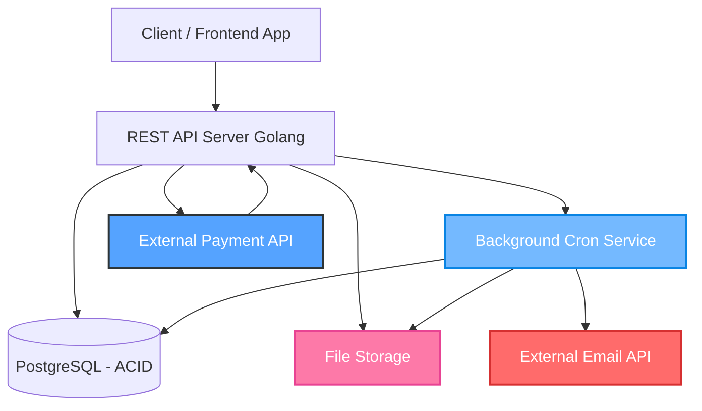
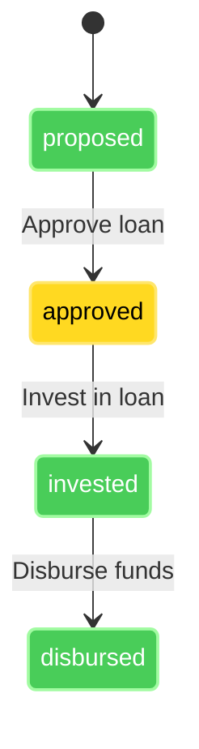
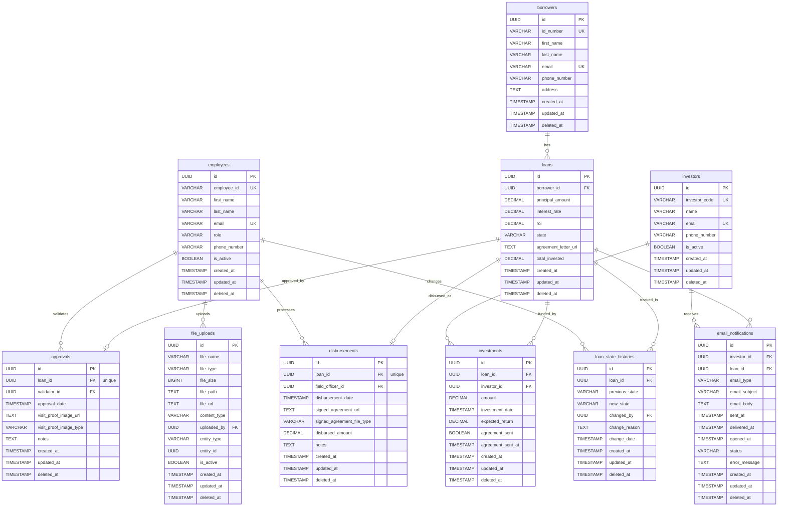

## ✅ Functional Requirements
1. Loan State Management
- FR-1.1: System shall support four loan states: proposed, approved, invested, and disbursed
- FR-1.2: All new loans shall be created with initial state proposed
- FR-1.3: State transitions shall only move forward (no backward transitions allowed)
- FR-1.4: System shall enforce valid state transition rules:
```
proposed → approved
approved → invested
invested → disbursed
```


2. Loan Approval Process

- FR-2.1: System shall allow staff to approve loans from proposed to approved state
- FR-2.2: Approval process shall require:

    - Picture proof of field validator visit to borrower
    - Employee ID of field validator
    - Date of approval


- FR-2.3: Once approved, loan cannot return to proposed state
- FR-2.4: Approved loans shall be available for investor offerings

3. Investment Management

- FR-3.1: System shall support multiple investors per loan
- FR-3.2: Each investor shall have their own investment amount
- FR-3.3: Total invested amount shall not exceed loan principal amount
- FR-3.4: Loan transitions to invested state when total invested amount equals loan principal
- FR-3.5: Upon reaching invested state, system shall send email notifications to all investors
- FR-3.6: Email notification shall contain link to agreement letter (PDF)

4. Disbursement Process

- FR-4.1: System shall support loan disbursement to borrowers
- FR-4.2: Disbursement process shall require:

    - Loan agreement letter signed by borrower (PDF/JPEG format)
    - Employee ID of field officer handling disbursement
    - Date of disbursement


- FR-4.3: System shall transition loan to disbursed state upon successful disbursement

5. Loan Data Management

- FR-5.1: System shall store and manage the following loan information:

    - Borrower ID number
    - Principal amount
    - Interest rate (defines total interest borrower pays)
    - ROI (Return on Investment for investors)
    - Link to generated agreement letter


- FR-5.2: System shall generate unique loan identifiers

6. RESTful API Requirements

- FR-6.1: System shall provide RESTful API endpoints for:

    - Creating new loans
    - Retrieving loan details
    - Updating loan state
    - Managing approvals
    - Managing investments
    - Managing disbursements


- FR-6.2: API shall follow REST conventions and HTTP methods
- FR-6.3: API shall return appropriate HTTP status codes
- FR-6.4: API shall support JSON request/response format

7. Document Management (We can assume we already have this)

- FR-7.1: System shall handle file uploads for approval proof images
- FR-7.2: System shall handle signed agreement letter uploads (PDF/JPEG)
- FR-7.3: System shall generate and store agreement letter links
- FR-7.4: System shall validate file formats and sizes

8. Notification System (We can assume we can sent the message)

- FR-8.1: System shall send email notifications to investors when loan reaches invested state
- FR-8.2: Email content shall include agreement letter access link
- FR-8.3: System shall track notification delivery status

## 📊 Non-Functional Requirements

 1. Performance & Scalability
  
  - NFR-1.1: Scale horizontally (use container)

 2. Reliability
  - NFR-2.1: Use database transactions to guarantee atomicity
  - NFR-2.2: Ensure disbursements are either fully processed or fully rolled back

 3. Testability
  - NFR-3.1: Unit tests for business logic (disbursement)
  - NFR-3.2: ~~Integration tests for API and DB flows~~
  - NFR-3.3: ~~End-to-end test for disbursement processing~~


 4. Auditability & Compliance
  - NFR-4.1: Log all transactions and changes with timestamps (look into table wallet transaction)
  - NFR-4.2: ~~Hide all user sensitive information (should be on log)~~


## 📦 Endpoint Specification

1.1 Create Loan

POST ```/loans```

Request Body
```
{
  "borrower_id": "550e8400-e29b-41d4-a716-446655440000",
  "principal_amount": 5000000.00,
  "interest_rate": 0.10,
  "roi": 0.08
}
```
Response ```201 Created```
```
{
  "success": true,
  "message": "Loan created successfully",
  "data": {
    "id": "1241dd30-0b81-4a18-a371-df32f8c24979",
    "borrower_name": "John Doe",
    "principal_amount": 5000000,
    "interest_rate": 0.1,
    "roi": 0.08,
    "state": "proposed",
    "total_invested": 0,
    "remaining_investment": 5000000,
    "investor_count": 0,
    "created_at": "2025-07-25T08:49:45.395761Z",
    "updated_at": "2025-07-25T08:49:45.395761Z"
  }
}
```
2.1 Approve Loan

POST ```POST /api/v1/loans/{loan_id}/approve```
Request Body
```
{
  "validator_id": "employee-uuid",
  "approval_date": "2025-07-24T11:00:00Z",
  "visit_proof_image_url": "https://storage.go10.com/proofs/visit-123.jpg",
  "visit_proof_image_type": "jpeg",
  "notes": "Borrower verified, business location confirmed"
}
```
Response ```200 OK```
```
{
  "status": "success",
  "message": "Loan approved successfully",
  "code": "SUCCESS",
  "data": {
    "approval_date": "2025-07-24T11:00:00Z",
    "id": "d98851df-4cb2-4763-a3ca-6e859c098124",
    "loan_id": "8906b826-2bd6-484b-9d1d-092a676f783e",
    "notes": "Borrower verified, business location confirmed",
    "state": "approved",
    "validator_id": "660e8400-e29b-41d4-a716-446655440004",
    "visit_proof_image_type": "jpeg",
    "visit_proof_image_url": "https://storage.go10.com/proofs/visit-123.jpg"
  }
}
```

3.1 Add Investment

POST ```POST /api/v1/loans/{loan_id}/invest```

Request Body
```
{
  "investor_id": "investor-uuid",
  "amount": 1000000.00,  
}
```
Response ```202 Accepted```
```
{
  "status": "success",
  "message": "Investment processed successfully",
  "code": "SUCCESS",
  "data": {
    "id": "ca9e7edf-e3b1-4cdc-99b9-c5d1def6fde2",
    "loan_id": "8906b826-2bd6-484b-9d1d-092a676f783e",
    "investor_id": "770e8400-e29b-41d4-a716-446655440004",
    "amount": 4000000,
    "expected_return": 4320000,
    "investment_date": "2025-07-24T11:00:00Z",
    "created_at": "2025-07-25T16:05:20.365281Z",
    "updated_at": "2025-07-25T16:05:20.365281Z"
  }
}
```

4.1 Disburse Loan

POST ```POST /api/v1/loans/{loan_id}/disburse```

Request Body
```
{
  "field_officer_id": "employee-uuid",
  "disbursement_date": "2025-07-24T14:00:00Z",
  "signed_agreement_url": "https://storage.go10.com/agreements/signed-123.pdf",
  "signed_agreement_file_type": "pdf",
  "disbursed_amount": 5000000.00,
  "notes": "Loan disbursed successfully to borrower account"
}
```
Response ```200 OK```
```
{
  "status": "success",
  "message": "Loan disbursed successfully",
  "code": "SUCCESS",
  "data": {
    "id": "abeb1b13-24e8-4b40-b2b9-a86300e9cd9b",
    "loan_id": "880e8400-e29b-41d4-a716-446655440004",
    "field_officer_id": "660e8400-e29b-41d4-a716-446655440001",
    "disbursement_date": "2025-07-24T14:00:00Z",
    "signed_agreement_url": "https://storage.go10.com/agreements/signed-123.pdf",
    "signed_agreement_file_type": "pdf",
    "disbursed_amount": 80000000,
    "notes": "Loan disbursed successfully to borrower account",
    "created_at": "2025-07-26T05:36:46.077769Z",
    "updated_at": "2025-07-26T05:36:46.077769Z"
  }
}
```

### 🏗️ System Design



### 🔄 Disbursement State Diagram


### 🔄 Erd Diagram
load service




# Loan Management System - Database Tables

## Core Entity Tables

### borrowers
Stores information about loan applicants.

| Column       | Type                     | Constraints                            | Description                   |
|--------------|--------------------------|----------------------------------------|-------------------------------|
| id           | UUID                     | PRIMARY KEY, DEFAULT gen_random_uuid() | Unique identifier             |
| id_number    | VARCHAR(50)              | UNIQUE, NOT NULL                       | Government/national ID number |
| first_name   | VARCHAR(100)             | NOT NULL                               | First name                    |
| last_name    | VARCHAR(100)             | NOT NULL                               | Last name                     |
| email        | VARCHAR(255)             | UNIQUE                                 | Email address                 |
| phone_number | VARCHAR(20)              | NOT NULL                               | Phone number                  |
| address      | TEXT                     |                                        | Physical address              |
| created_at   | TIMESTAMP WITH TIME ZONE | DEFAULT NOW()                          | Record creation timestamp     |
| updated_at   | TIMESTAMP WITH TIME ZONE | DEFAULT NOW()                          | Last update timestamp         |
| deleted_at   | TIMESTAMP WITH TIME ZONE |                                        | Soft delete timestamp         |

**Indexes:**
- `idx_borrowers_id_number` on `id_number`
- `idx_borrowers_email` on `email`
- `idx_borrowers_deleted_at` on `deleted_at`

---

### employees
Stores information about system users (validators, field officers, etc.).

| Column       | Type                     | Constraints                            | Description                    |
|--------------|--------------------------|----------------------------------------|--------------------------------|
| id           | UUID                     | PRIMARY KEY, DEFAULT gen_random_uuid() | Unique identifier              |
| employee_id  | VARCHAR(50)              | UNIQUE, NOT NULL                       | Employee identification number |
| first_name   | VARCHAR(100)             | NOT NULL                               | First name                     |
| last_name    | VARCHAR(100)             | NOT NULL                               | Last name                      |
| email        | VARCHAR(255)             | UNIQUE, NOT NULL                       | Email address                  |
| role         | VARCHAR(50)              | NOT NULL                               | Employee role/position         |
| phone_number | VARCHAR(20)              |                                        | Phone number                   |
| is_active    | BOOLEAN                  | DEFAULT true                           | Active status                  |
| created_at   | TIMESTAMP WITH TIME ZONE | DEFAULT NOW()                          | Record creation timestamp      |
| updated_at   | TIMESTAMP WITH TIME ZONE | DEFAULT NOW()                          | Last update timestamp          |
| deleted_at   | TIMESTAMP WITH TIME ZONE |                                        | Soft delete timestamp          |

**Indexes:**
- `idx_employees_employee_id` on `employee_id`
- `idx_employees_email` on `email`
- `idx_employees_role` on `role`
- `idx_employees_deleted_at` on `deleted_at`

---

### investors
Stores information about people who fund loans.

| Column        | Type                     | Constraints                            | Description                  |
|---------------|--------------------------|----------------------------------------|------------------------------|
| id            | UUID                     | PRIMARY KEY, DEFAULT gen_random_uuid() | Unique identifier            |
| investor_code | VARCHAR(50)              | UNIQUE, NOT NULL                       | Investor identification code |
| name          | VARCHAR(255)             | NOT NULL                               | Full name                    |
| email         | VARCHAR(255)             | UNIQUE, NOT NULL                       | Email address                |
| phone_number  | VARCHAR(20)              |                                        | Phone number                 |
| is_active     | BOOLEAN                  | DEFAULT true                           | Active status                |
| created_at    | TIMESTAMP WITH TIME ZONE | DEFAULT NOW()                          | Record creation timestamp    |
| updated_at    | TIMESTAMP WITH TIME ZONE | DEFAULT NOW()                          | Last update timestamp        |
| deleted_at    | TIMESTAMP WITH TIME ZONE |                                        | Soft delete timestamp        |

**Indexes:**
- `idx_investors_investor_code` on `investor_code`
- `idx_investors_email` on `email`
- `idx_investors_deleted_at` on `deleted_at`

---

## Core Business Tables

### loans
Central table storing loan applications and their current state.

| Column               | Type                     | Constraints                            | Description                       |
|----------------------|--------------------------|----------------------------------------|-----------------------------------|
| id                   | UUID                     | PRIMARY KEY, DEFAULT gen_random_uuid() | Unique identifier                 |
| borrower_id          | UUID                     | NOT NULL, FK to borrowers(id)          | Reference to borrower             |
| principal_amount     | DECIMAL(15,2)            | NOT NULL, CHECK > 0                    | Loan amount requested             |
| interest_rate        | DECIMAL(5,4)             | NOT NULL, CHECK 0-1                    | Interest rate (as decimal)        |
| roi                  | DECIMAL(5,4)             | NOT NULL, CHECK 0-1                    | Return on investment (as decimal) |
| state                | VARCHAR(20)              | NOT NULL, DEFAULT 'proposed'           | Current loan state                |
| agreement_letter_url | TEXT                     |                                        | URL to agreement document         |
| total_invested       | DECIMAL(15,2)            | DEFAULT 0, CHECK >= 0                  | Total amount invested so far      |
| created_at           | TIMESTAMP WITH TIME ZONE | DEFAULT NOW()                          | Record creation timestamp         |
| updated_at           | TIMESTAMP WITH TIME ZONE | DEFAULT NOW()                          | Last update timestamp             |
| deleted_at           | TIMESTAMP WITH TIME ZONE |                                        | Soft delete timestamp             |

**Constraints:**
- `chk_loan_state`: state IN ('proposed', 'approved', 'invested', 'disbursed')

**Indexes:**
- `idx_loans_borrower_id` on `borrower_id`
- `idx_loans_state` on `state`
- `idx_loans_created_at` on `created_at`
- `idx_loans_deleted_at` on `deleted_at`

---

### approvals
Stores loan approval records with validation details.

| Column                 | Type                     | Constraints                            | Description                      |
|------------------------|--------------------------|----------------------------------------|----------------------------------|
| id                     | UUID                     | PRIMARY KEY, DEFAULT gen_random_uuid() | Unique identifier                |
| loan_id                | UUID                     | UNIQUE, NOT NULL, FK to loans(id)      | Reference to loan (1:1)          |
| validator_id           | UUID                     | NOT NULL, FK to employees(id)          | Reference to validating employee |
| approval_date          | TIMESTAMP WITH TIME ZONE | NOT NULL                               | Date of approval                 |
| visit_proof_image_url  | TEXT                     | NOT NULL                               | URL to visit proof image         |
| visit_proof_image_type | VARCHAR(10)              | NOT NULL                               | File type of proof image         |
| notes                  | TEXT                     |                                        | Additional notes                 |
| created_at             | TIMESTAMP WITH TIME ZONE | DEFAULT NOW()                          | Record creation timestamp        |
| updated_at             | TIMESTAMP WITH TIME ZONE | DEFAULT NOW()                          | Last update timestamp            |
| deleted_at             | TIMESTAMP WITH TIME ZONE |                                        | Soft delete timestamp            |

**Constraints:**
- `chk_visit_proof_image_type`: visit_proof_image_type IN ('pdf', 'jpeg', 'png')

**Indexes:**
- `idx_approvals_loan_id` on `loan_id`
- `idx_approvals_validator_id` on `validator_id`
- `idx_approvals_approval_date` on `approval_date`
- `idx_approvals_deleted_at` on `deleted_at`

---

### investments
Stores individual investment records for loans.

| Column            | Type                     | Constraints                            | Description                |
|-------------------|--------------------------|----------------------------------------|----------------------------|
| id                | UUID                     | PRIMARY KEY, DEFAULT gen_random_uuid() | Unique identifier          |
| loan_id           | UUID                     | NOT NULL, FK to loans(id)              | Reference to loan          |
| investor_id       | UUID                     | NOT NULL, FK to investors(id)          | Reference to investor      |
| amount            | DECIMAL(15,2)            | NOT NULL, CHECK > 0                    | Investment amount          |
| investment_date   | TIMESTAMP WITH TIME ZONE | NOT NULL                               | Date of investment         |
| expected_return   | DECIMAL(15,2)            | NOT NULL, CHECK >= 0                   | Expected return amount     |
| agreement_sent    | BOOLEAN                  | DEFAULT false                          | Whether agreement was sent |
| agreement_sent_at | TIMESTAMP WITH TIME ZONE |                                        | When agreement was sent    |
| created_at        | TIMESTAMP WITH TIME ZONE | DEFAULT NOW()                          | Record creation timestamp  |
| updated_at        | TIMESTAMP WITH TIME ZONE | DEFAULT NOW()                          | Last update timestamp      |
| deleted_at        | TIMESTAMP WITH TIME ZONE |                                        | Soft delete timestamp      |

**Indexes:**
- `idx_investments_loan_id` on `loan_id`
- `idx_investments_investor_id` on `investor_id`
- `idx_investments_investment_date` on `investment_date`
- `idx_investments_deleted_at` on `deleted_at`

---

### disbursements
Stores loan disbursement records.

| Column                     | Type                     | Constraints                            | Description                |
|----------------------------|--------------------------|----------------------------------------|----------------------------|
| id                         | UUID                     | PRIMARY KEY, DEFAULT gen_random_uuid() | Unique identifier          |
| loan_id                    | UUID                     | UNIQUE, NOT NULL, FK to loans(id)      | Reference to loan (1:1)    |
| field_officer_id           | UUID                     | NOT NULL, FK to employees(id)          | Reference to field officer |
| disbursement_date          | TIMESTAMP WITH TIME ZONE | NOT NULL                               | Date of disbursement       |
| signed_agreement_url       | TEXT                     | NOT NULL                               | URL to signed agreement    |
| signed_agreement_file_type | VARCHAR(10)              | NOT NULL                               | File type of agreement     |
| disbursed_amount           | DECIMAL(15,2)            | NOT NULL, CHECK > 0                    | Amount disbursed           |
| notes                      | TEXT                     |                                        | Additional notes           |
| created_at                 | TIMESTAMP WITH TIME ZONE | DEFAULT NOW()                          | Record creation timestamp  |
| updated_at                 | TIMESTAMP WITH TIME ZONE | DEFAULT NOW()                          | Last update timestamp      |
| deleted_at                 | TIMESTAMP WITH TIME ZONE |                                        | Soft delete timestamp      |

**Constraints:**
- `chk_signed_agreement_file_type`: signed_agreement_file_type IN ('pdf', 'jpeg', 'png')

**Indexes:**
- `idx_disbursements_loan_id` on `loan_id`
- `idx_disbursements_field_officer_id` on `field_officer_id`
- `idx_disbursements_disbursement_date` on `disbursement_date`
- `idx_disbursements_deleted_at` on `deleted_at`

---

## Audit and Tracking Tables

### loan_state_histories
Audit trail for loan state changes.

| Column         | Type                     | Constraints                            | Description                  |
|----------------|--------------------------|----------------------------------------|------------------------------|
| id             | UUID                     | PRIMARY KEY, DEFAULT gen_random_uuid() | Unique identifier            |
| loan_id        | UUID                     | NOT NULL, FK to loans(id)              | Reference to loan            |
| previous_state | VARCHAR(20)              | CHECK valid states                     | Previous loan state          |
| new_state      | VARCHAR(20)              | NOT NULL, CHECK valid states           | New loan state               |
| changed_by     | UUID                     | NOT NULL, FK to employees(id)          | Employee who made the change |
| change_reason  | TEXT                     |                                        | Reason for state change      |
| change_date    | TIMESTAMP WITH TIME ZONE | NOT NULL                               | When change occurred         |
| created_at     | TIMESTAMP WITH TIME ZONE | DEFAULT NOW()                          | Record creation timestamp    |
| updated_at     | TIMESTAMP WITH TIME ZONE | DEFAULT NOW()                          | Last update timestamp        |
| deleted_at     | TIMESTAMP WITH TIME ZONE |                                        | Soft delete timestamp        |

**Constraints:**
- `chk_previous_state`: previous_state IN ('proposed', 'approved', 'invested', 'disbursed')
- `chk_new_state`: new_state IN ('proposed', 'approved', 'invested', 'disbursed')

**Indexes:**
- `idx_loan_state_histories_loan_id` on `loan_id`
- `idx_loan_state_histories_change_date` on `change_date`
- `idx_loan_state_histories_deleted_at` on `deleted_at`

---

## Communication and File Management

### email_notifications
Tracks email communications with investors.

| Column        | Type                     | Constraints                            | Description               |
|---------------|--------------------------|----------------------------------------|---------------------------|
| id            | UUID                     | PRIMARY KEY, DEFAULT gen_random_uuid() | Unique identifier         |
| investor_id   | UUID                     | NOT NULL, FK to investors(id)          | Reference to investor     |
| loan_id       | UUID                     | NOT NULL, FK to loans(id)              | Reference to loan         |
| email_type    | VARCHAR(50)              | NOT NULL                               | Type of email sent        |
| email_subject | VARCHAR(255)             | NOT NULL                               | Email subject line        |
| email_body    | TEXT                     | NOT NULL                               | Email content             |
| sent_at       | TIMESTAMP WITH TIME ZONE | NOT NULL                               | When email was sent       |
| delivered_at  | TIMESTAMP WITH TIME ZONE |                                        | When email was delivered  |
| opened_at     | TIMESTAMP WITH TIME ZONE |                                        | When email was opened     |
| status        | VARCHAR(20)              | DEFAULT 'sent'                         | Email delivery status     |
| error_message | TEXT                     |                                        | Error message if failed   |
| created_at    | TIMESTAMP WITH TIME ZONE | DEFAULT NOW()                          | Record creation timestamp |
| updated_at    | TIMESTAMP WITH TIME ZONE | DEFAULT NOW()                          | Last update timestamp     |
| deleted_at    | TIMESTAMP WITH TIME ZONE |                                        | Soft delete timestamp     |

**Constraints:**
- `chk_email_status`: status IN ('sent', 'delivered', 'opened', 'failed')

**Indexes:**
- `idx_email_notifications_investor_id` on `investor_id`
- `idx_email_notifications_loan_id` on `loan_id`
- `idx_email_notifications_sent_at` on `sent_at`
- `idx_email_notifications_deleted_at` on `deleted_at`

---

### file_uploads
Generic file storage table for all document uploads.

| Column       | Type                     | Constraints                            | Description                    |
|--------------|--------------------------|----------------------------------------|--------------------------------|
| id           | UUID                     | PRIMARY KEY, DEFAULT gen_random_uuid() | Unique identifier              |
| file_name    | VARCHAR(255)             | NOT NULL                               | Original filename              |
| file_type    | VARCHAR(10)              | NOT NULL                               | File extension                 |
| file_size    | BIGINT                   | NOT NULL, CHECK > 0                    | File size in bytes             |
| file_path    | TEXT                     | NOT NULL                               | Storage path                   |
| file_url     | TEXT                     | NOT NULL                               | Access URL                     |
| content_type | VARCHAR(100)             | NOT NULL                               | MIME content type              |
| uploaded_by  | UUID                     | NOT NULL, FK to employees(id)          | Employee who uploaded          |
| entity_type  | VARCHAR(50)              | NOT NULL                               | Type of entity file belongs to |
| entity_id    | UUID                     | NOT NULL                               | ID of entity file belongs to   |
| is_active    | BOOLEAN                  | DEFAULT true                           | Active status                  |
| created_at   | TIMESTAMP WITH TIME ZONE | DEFAULT NOW()                          | Record creation timestamp      |
| updated_at   | TIMESTAMP WITH TIME ZONE | DEFAULT NOW()                          | Last update timestamp          |
| deleted_at   | TIMESTAMP WITH TIME ZONE |                                        | Soft delete timestamp          |

**Constraints:**
- `chk_file_type`: file_type IN ('pdf', 'jpeg', 'png')

**Indexes:**
- `idx_file_uploads_entity_id` on `entity_id`
- `idx_file_uploads_entity_type` on `entity_type`
- `idx_file_uploads_uploaded_by` on `uploaded_by`
- `idx_file_uploads_deleted_at` on `deleted_at`

---

## Database Extensions

The schema uses the following PostgreSQL extensions:

- **pgcrypto**: Provides cryptographic functions, used for `gen_random_uuid()` function

## Common Patterns

### Soft Deletes
All tables implement soft deletes using the `deleted_at` timestamp column. Records are not physically deleted but marked as deleted.

### Audit Timestamps
All tables include:
- `created_at`: When the record was created
- `updated_at`: When the record was last modified
- `deleted_at`: When the record was soft deleted (if applicable)

### UUID Primary Keys
All tables use UUID primary keys generated using `gen_random_uuid()` for better distribution and security.